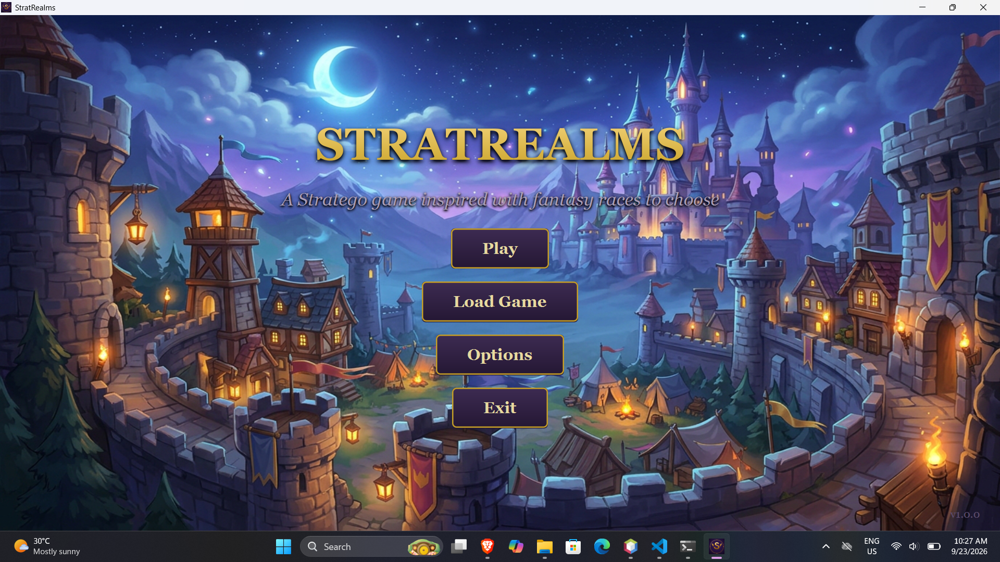
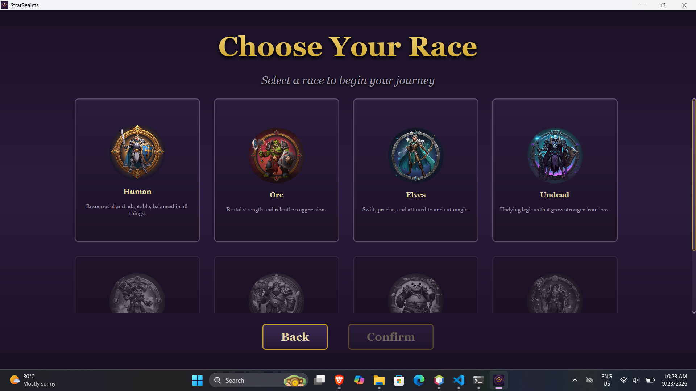
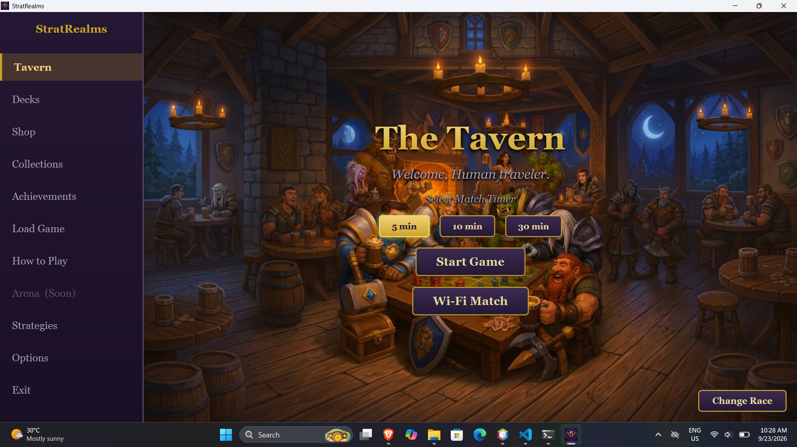
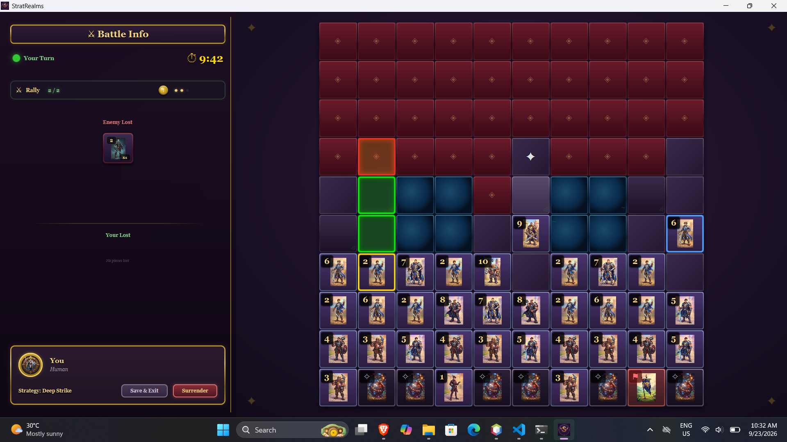
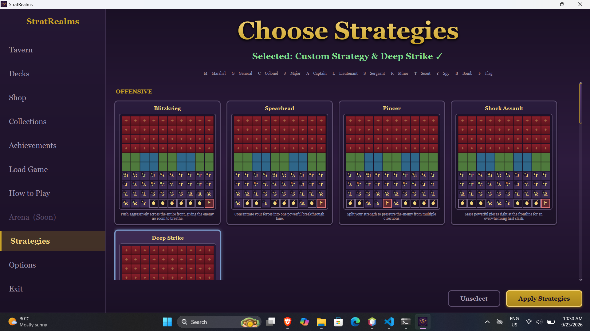
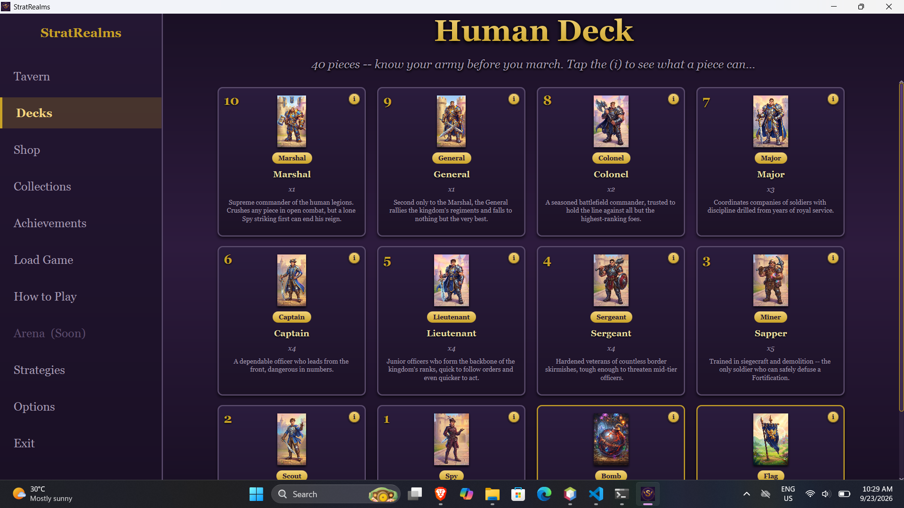
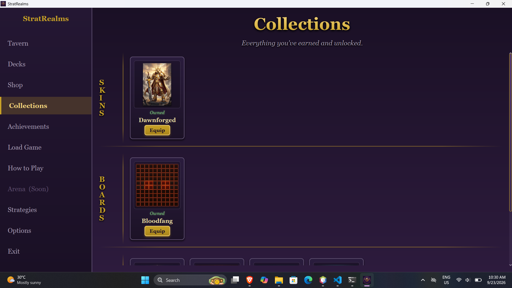
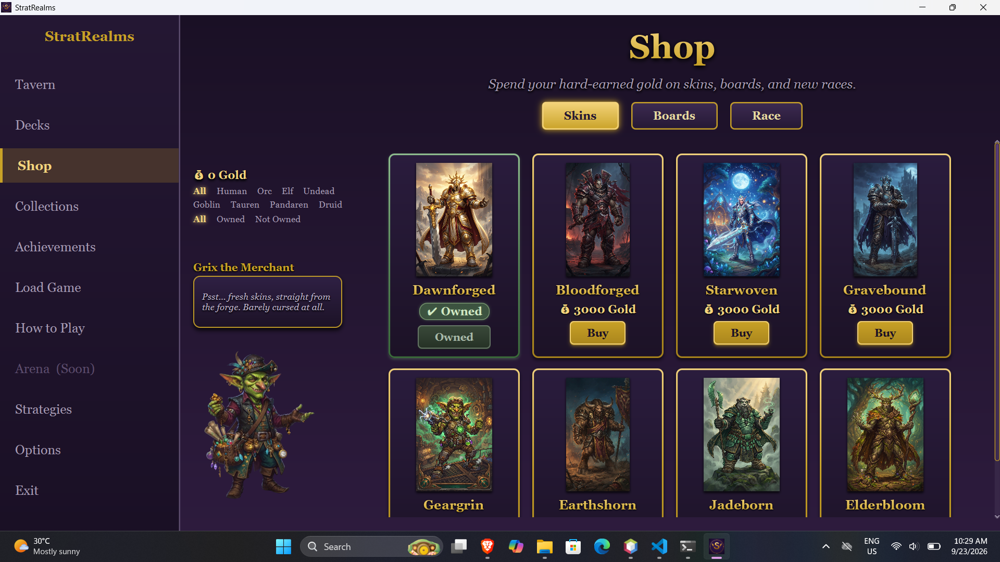
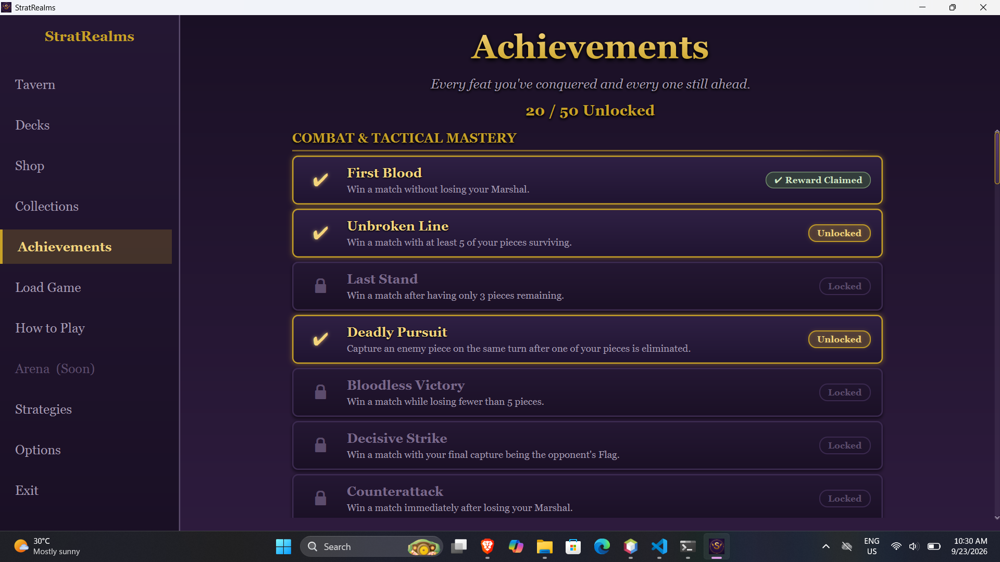

# StratRealms

A fantasy-themed tactical strategy board game inspired by Stratego. Choose your race, build your formation, and battle across a 10×10 battlefield of hidden information, terrain, and race-defining Marshal skills.

> **Status:** Public Beta — available now on [itch.io](https://expn.itch.io/stratrealms)

---

## About

StratRealms brings classic hidden-piece tactical combat into a fantasy setting. Every match is a duel of bluffing, positioning, and one decisive Marshal skill that can flip the board.

- **8 playable races** — each with a unique Marshal ability
- **Single-player** battles against AI opponents
- **Local Wi-Fi multiplayer** for one-on-one matches on the same network
- **15 premade strategies** plus custom formation editing
- **Persistent progression** — collect skins, boards, races, and achievements
- **Full save & load** support mid-match
- **Interactive tutorial** that teaches the rules as you play

---

## Screenshots

### Start Menu

### Race Select

### Tavern

### Battle

### Strategies

### Deck Preview

### Collections

### Shop

### Achievements

---

## The Races

Each faction fields the same classic roster — Marshal, General, Colonel, Major, Captain, Lieutenant, Sergeant, Miner, Scout, Spy, Bomb, and Flag — but the Marshal carries a signature skill.

| Race     | Marshal Skill | Effect                                                        |
| -------- | ------------- | ------------------------------------------------------------- |
| Human    | Rally         | The Marshal gains an extra move this turn                     |
| Orc      | Berserk       | After winning an attack, the Marshal may attack again         |
| Elves    | True Sight    | Reveal all enemy pieces the Marshal could attack for one turn |
| Undead   | Necromancy    | Revive a fallen piece on its original square                  |
| Goblin   | Ambush        | Swap places with an adjacent ally                             |
| Tauren   | Warstomp      | Push an adjacent enemy one square further                     |
| Pandaren | Inner Peace   | Shield nearby allies from attack for one turn                 |
| Druid    | Entangle      | Root an enemy piece so it cannot move                         |

---

## Download

The public beta is available on **itch.io**:

**[expn.itch.io/stratrealms](https://expn.itch.io/stratrealms)**

The game comes with its own bundled runtime — **no Java install required**. Download, extract, and play.

### System Requirements

- Windows 10 or 11 (64-bit)
- Dual-core CPU (quad-core recommended)
- 2 GB RAM minimum, 4 GB recommended
- ~300 MB free disk space

---

## Roadmap

### Beta Phase 1 — Now

- Public beta release
- Single-player vs AI
- Local Wi-Fi multiplayer
- All 8 races and Marshal skills

### Beta Phase 2 — Coming Soon

Details to be announced.

### Full Release — Coming Soon

Details to be announced.

---

## Reporting Bugs

Found something broken? Please open an issue on the [Issues page](../../issues) or use the in-game bug report form on the website.

When reporting a bug, please include:

- What you were doing when it happened
- What you expected to happen
- What actually happened
- Your OS and whether you're playing single-player or local multiplayer

---

## Links

- **itch.io:** [expn.itch.io/stratrealms](https://expn.itch.io/stratrealms)
- **Issues:** [github.com/alecxander567/StratRelams/issues](../../issues)

---

## License

This project is released under the MIT License. See [LICENSE](LICENSE) for details.
